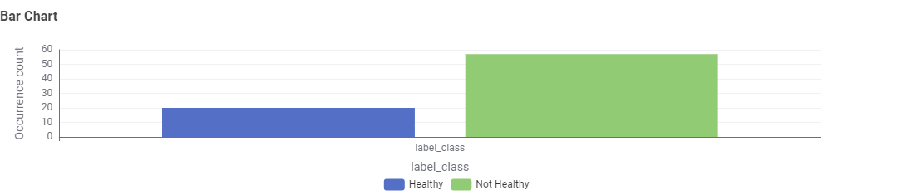
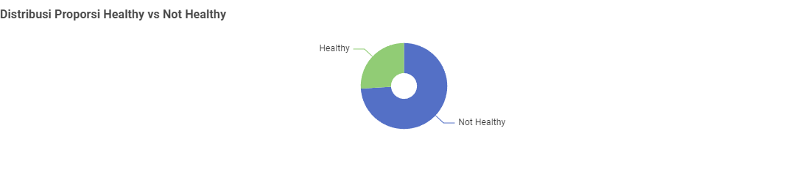
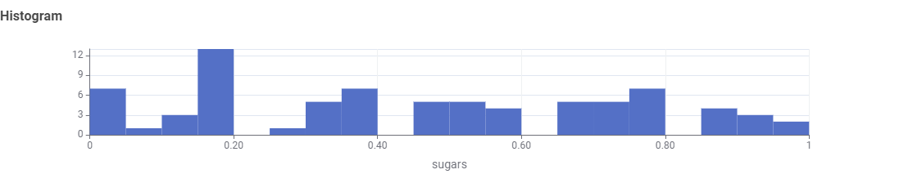
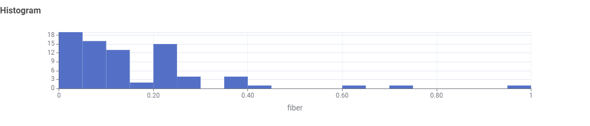
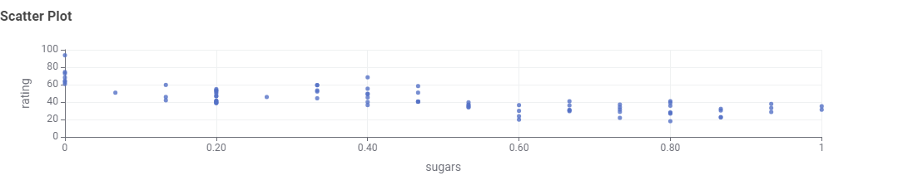
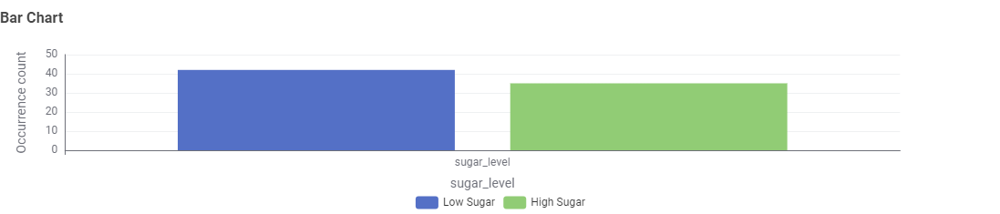

# 🥣 **Cereal Analysis – KNIME Workflow**

Analisis nutrisi, visualisasi data, dan klasifikasi kesehatan sereal berdasarkan kandungan **fiber**, **sugar**, dan nilai **normalisasi**.

---

## 📌 **Deskripsi Proyek**

Repository ini berisi **workflow KNIME Modern UI** untuk melakukan analisis pada dataset sereal *Cereals.csv*.
Tujuan utama workflow:

1. **Membersihkan & mempersiapkan dataset**
2. **Melakukan exploratory data analysis (EDA)**
3. **Menghitung metric sederhana menggunakan Math Formula**
4. **Visualisasi nutrisi: bar chart, pie chart, histogram, scatter plot**
5. **Membuat dua jenis klasifikasi:**

   * **Healthy vs Not Healthy** (berdasarkan fiber & sugars)
   * **Low Sugar vs High Sugar** (berdasarkan nilai sugar yang sudah dinormalisasi)
6. **Memberikan insight komprehensif tentang nutrisi sereal**

Workflow dibuat ringkas, modular, dan mudah dipahami sehingga cocok untuk pemula KNIME.

---

## 📁 **Isi Repository**

```
📦 Cereal-Analysis-KNIME
├── cerealworkfloow.knwf     → workflow KNIME Modern UI
├── Cereals.csv             → dataset sereal
├── README.md               → dokumentasi proyek
```

---

## 🧠 **Alur Workflow (Ringkasan)**

```
CSV Reader
 → Missing Value
 → Column Filter
 → Math Formula
 → Rule Engine (Healthy / Not Healthy)
        ↳ Bar Chart (Distribusi Kesehatan)
        ↳ Pie Chart (Proporsi Healthy)
 → Normalizer
        ↳ Histogram (Distribusi Numerik)
        ↳ Scatter Plot (Perbandingan Variabel)
 → Rule Engine (Low Sugar / High Sugar)
        ↳ Bar Chart (Klasifikasi Gula)
```

---

# 🥼 **1. Data Preparation**

### ✔ **CSV Reader**

Mengimpor dataset *Cereals.csv* ke dalam KNIME.

### ✔ **Missing Value**

Menangani missing value:

* Kolom numerik → *median*
* Kolom kategorikal → *most frequent*

Tujuannya agar visualisasi dan perhitungan tidak error.

### ✔ **Column Filter**

Menghapus kolom tidak relevan atau kolom kategori yang tidak digunakan dalam perhitungan.

### ✔ **Math Formula**

Menghitung **metric nutrisi sederhana** menggunakan formula:

```
$fiber$ * 2 - $sugars$
```

Nilai ini tidak digunakan sebagai klasifikasi, tetapi membantu:

* Memberikan pemahaman tambahan tentang keseimbangan serat & gula
* Menambah variabel tambahan untuk analisis

---

# ⚙️ **2. Data Processing**

## ✔ **Rule Engine 1 – Klasifikasi Healthy / Not Healthy**

Aturan yang digunakan:

```
$fiber$ >= 5 AND $sugars$ <= 6 => "Healthy"
TRUE => "Not Healthy"
```

Interpretasi:

* Produk dikategorikan **Healthy** jika tinggi serat **≥ 5** dan rendah gula **≤ 6**
* Selain itu → **Not Healthy**

Hasil kategori ini digunakan untuk:

* Bar Chart distribusi kesehatan
* Pie Chart proporsi Healthy & Not Healthy

---

## ✔ **Normalizer**

Menormalkan kolom numerik ke skala 0–1 sehingga lebih mudah dianalisis di scatter plot & histogram.

---

## ✔ **Rule Engine 2 – Klasifikasi Low Sugar / High Sugar**

Setelah normalisasi, dibuat klasifikasi kedua:

```
$sugars$ <= 0.468 => "Low Sugar"
TRUE => "High Sugar"
```

Catatan:

* Batas **0.468** berasal dari nilai *sugars* yang sudah dinormalisasi
* Klasifikasi ini menunjukkan bagaimana distribusi gula setelah skala diseragamkan

Hasilnya divisualisasikan dengan Bar Chart.

---

# 📊 **3. Visualisasi**

### 🔹 **Bar Chart – Healthy vs Not Healthy**

Menampilkan jumlah produk pada kedua kategori menggunakan occuurence count
- bar chart menunjukan lebih banyak cereal yang not healthy dibanding healthy


### 🔹 **Pie Chart**

Memvisualisasikan presentase Healthy vs Not Healthy
- Pie chart menunjukan 25.97% cereal healthy dan 74.03% cereal lainnya not healthy


### 🔹 **Histogram**

Digunakan di sini untuk menampilkan distribusi variabel numerik fiber dan sugar
Insight umum:
* Sebagian besar sereal memiliki kandungan **gula cukup tinggi**



* Fiber cenderung rendah pada kebanyakan produk



### 🔹 **Scatter Plot**

Menampilkan hubungan antar variabel, hasil normalisasi sugar vs rating:
* sugar vs rating


Scatter plot membantu melihat pola umum seperti:
* Gula tinggi cenderung berhubungan dengan rating rendah
* Gula rendah lebih tinggi ratingnya
* Produk sehat biasanya muncul di area gula rendah

### 🔹 **Bar Chart – Low Sugar vs High Sugar**

Menggambarkan distribusi produk berdasarkan tingkat gula setelah normalisasi.
- bar chart menunjukkan lebih banyak low sugar dibanding high sugar


---

# 📈 **5. Insight Utama**

Beberapa temuan penting dari workflow:

* Sereal **Healthy** jauh lebih sedikit dibanding **Not Healthy**
* Mayoritas produk memiliki **fiber rendah** dan **gula tinggi**
* Produk Low Sugar berdasarkan normalizer juga sangat sedikit
* Scatter plot menunjukkan pola jelas:
  gula ↑ → rating ↓
* Histogram menegaskan bahwa banyak sereal didesain manis

---

# 🧩 **4. Klasifikasi**

Workflow menggunakan **dua klasifikasi deterministik**:

### **1️⃣ Healthy vs Not Healthy**

Berdasarkan kombinasi *high fiber* & *low sugar*.

### **2️⃣ Low Sugar vs High Sugar**

Berdasarkan nilai sugar setelah dinormalisasi.

---

# 🏁 **6. Kesimpulan**

Berdasarkan analisis:

**Sebagian besar sereal di pasaran tidak masuk kategori Healthy**, karena tidak memenuhi syarat serat tinggi dan gula rendah.
Visualisasi dan klasifikasi dalam workflow KNIME ini memberikan gambaran jelas mengenai kualitas nutrisi sereal serta membantu memahami pola hubungan antar variabel.
